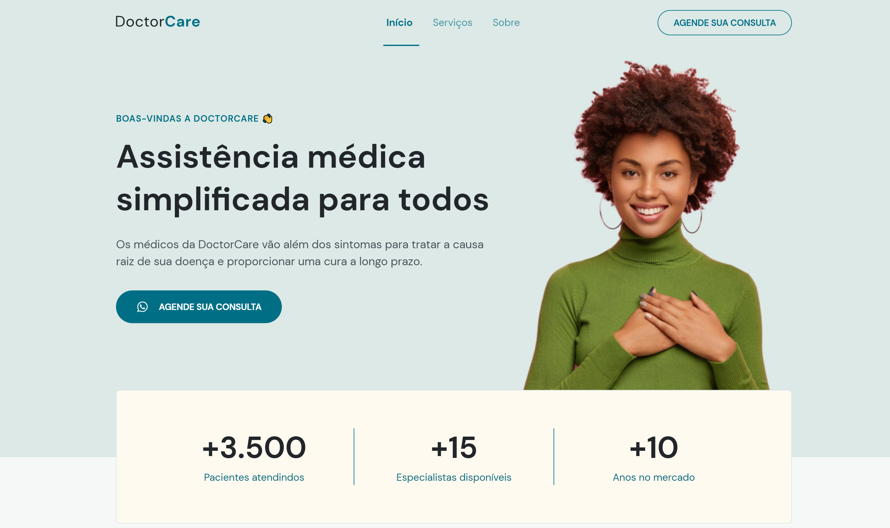

<h1 align="center"> DoctorCare </h1>

  <a href="#-tecnologias">Tecnologias</a>&nbsp;&nbsp;&nbsp;|&nbsp;&nbsp;&nbsp;
  <a href="#-projeto">Projeto</a>&nbsp;&nbsp;&nbsp;|&nbsp;&nbsp;&nbsp;
  <a href="#-layout">Layout</a>

## 🚀 Tecnologias

Esse projeto foi desenvolvido com as seguintes tecnologias:

- HTML
- CSS
- JavaScript
- Git and GitHub

## 💻 Projeto

Este projeto é uma página de uma clínica médica com layout responsivo, onde o usuário poderá ver informações de serviços prestados e fazer agendamento.  
Obs: Projeto construído no evento NLW (Next Level Week #8) realizado pela [Rocketseat](https://rocketseat.com.br).

## 🔖 Layout

Você pode visualizar o layout do projeto através [DESSE LINK](https://www.figma.com/file/3tLG4fPAdsZsmU6cPFFc7X/DoctorCare/duplicate). É necessário ter conta no [Figma](https://figma.com) para acessá-lo.